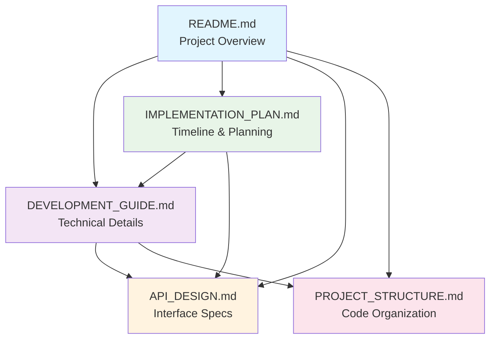

# Documentation Index

Welcome to the Jira Server MCP TypeScript Implementation documentation. This collection of documents provides comprehensive guidance for understanding, developing, and implementing the project.

## 📚 Documentation Structure

### 🏠 [Project Overview](../README.md)
**Start here** - Project goals, key advantages, quick start guide, and technology stack overview.

**Best for:** Understanding what the project does and getting started quickly.

### 🏗️ [Development Guide](./DEVELOPMENT_GUIDE.md)  
**Technical Details** - Architecture design, MCP implementation strategy, field selection, and development environment setup.

**Best for:** Understanding the technical architecture and implementation approach.

### 📅 [Implementation Plan](./IMPLEMENTATION_PLAN.md)
**Project Timeline** - 8-week development plan with phases, milestones, risk mitigation, and success criteria.

**Best for:** Project planning, tracking progress, and understanding development phases.

### 🎯 [API Design](./API_DESIGN.md)
**Interface Specifications** - Complete MCP tools and resources specifications with examples and field filtering implementation.

**Best for:** Understanding the API interface, implementing tools, and integration.

### 📁 [Project Structure](./PROJECT_STRUCTURE.md)
**Code Organization** - Directory layout, module organization, naming conventions, and architectural principles.

**Best for:** Understanding code organization and setting up the project structure.

## 🔗 Document Relationships

## 📖 Reading Paths

### 🚀 For Quick Start
1. [Project Overview](../README.md) - Understand goals and setup
2. [Development Guide](./DEVELOPMENT_GUIDE.md) - Technical architecture
3. [Implementation Plan](./IMPLEMENTATION_PLAN.md) - Development approach

### 🔧 For Implementation
1. [Project Structure](./PROJECT_STRUCTURE.md) - Code organization
2. [API Design](./API_DESIGN.md) - Interface specifications
3. [Development Guide](./DEVELOPMENT_GUIDE.md) - Technical details

### 📋 For Project Management
1. [Implementation Plan](./IMPLEMENTATION_PLAN.md) - Timeline and phases
2. [Project Overview](../README.md) - Goals and scope
3. [API Design](./API_DESIGN.md) - Deliverable specifications

## 🎯 Key Concepts Cross-Reference

| Concept | Primary Document | Supporting Documents |
|---------|------------------|---------------------|
| **MCP Tools** | [API Design](./API_DESIGN.md) | [Development Guide](./DEVELOPMENT_GUIDE.md) |
| **MCP Resources** | [API Design](./API_DESIGN.md) | [Development Guide](./DEVELOPMENT_GUIDE.md) |
| **Field Selection** | [Development Guide](./DEVELOPMENT_GUIDE.md) | [API Design](./API_DESIGN.md) |
| **Project Timeline** | [Implementation Plan](./IMPLEMENTATION_PLAN.md) | [Project Overview](../README.md) |
| **Architecture** | [Development Guide](./DEVELOPMENT_GUIDE.md) | [Project Structure](./PROJECT_STRUCTURE.md) |
| **PAT Authentication** | [Development Guide](./DEVELOPMENT_GUIDE.md) | [Project Overview](../README.md) |
| **TypeScript Structure** | [Project Structure](./PROJECT_STRUCTURE.md) | [Development Guide](./DEVELOPMENT_GUIDE.md) |

## 📝 Document Status

| Document | Status | Last Updated | Primary Audience |
|----------|--------|--------------|------------------|
| [README.md](../README.md) | ✅ Complete | Current | All stakeholders |
| [DEVELOPMENT_GUIDE.md](./DEVELOPMENT_GUIDE.md) | ✅ Complete | Current | Developers |
| [IMPLEMENTATION_PLAN.md](./IMPLEMENTATION_PLAN.md) | ✅ Complete | Current | Project managers |
| [API_DESIGN.md](./API_DESIGN.md) | ✅ Complete | Current | API developers |
| [PROJECT_STRUCTURE.md](./PROJECT_STRUCTURE.md) | ✅ Complete | Current | Developers |

## 🤝 Contributing to Documentation

When updating documentation:

1. **Cross-reference updates** - Update related documents when making changes
2. **Maintain consistency** - Keep terminology and examples consistent across documents
3. **Update this index** - Reflect significant changes in the document relationships
4. **Version control** - Update the "Last Updated" column above

## 📧 Quick Navigation

- **🏠 Home**: [Project Overview](../README.md)
- **🔧 Technical**: [Development Guide](./DEVELOPMENT_GUIDE.md)  
- **📅 Planning**: [Implementation Plan](./IMPLEMENTATION_PLAN.md)
- **🎯 API**: [API Design](./API_DESIGN.md)
- **📁 Structure**: [Project Structure](./PROJECT_STRUCTURE.md)